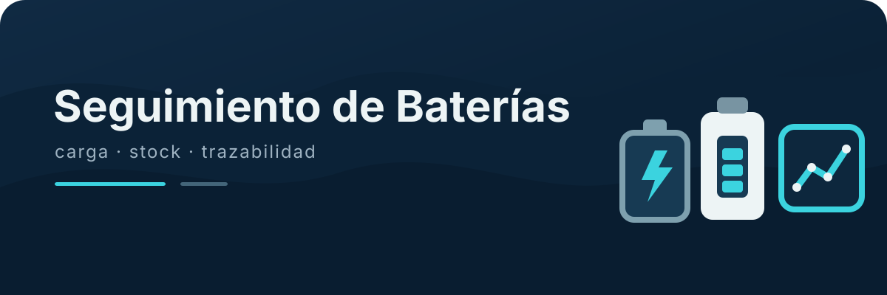
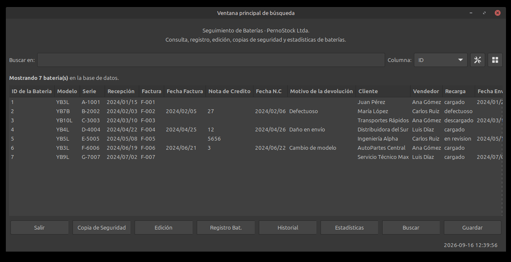
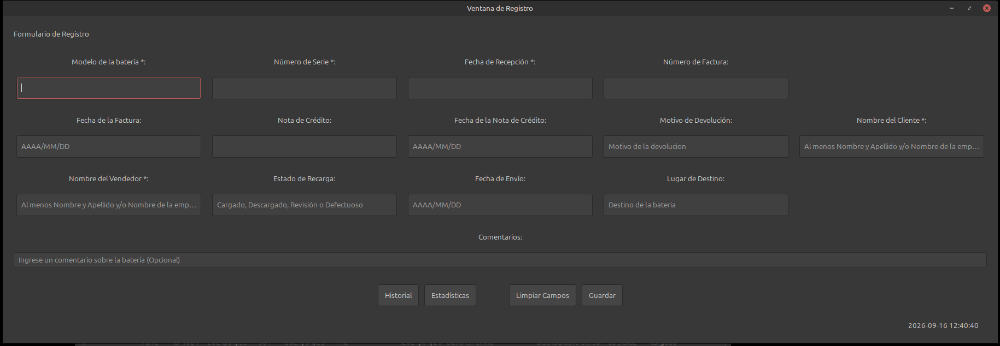
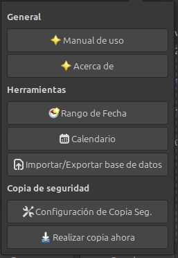
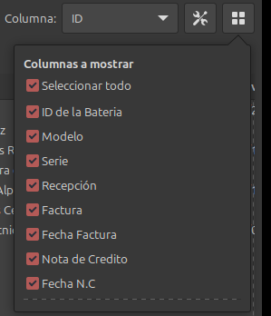
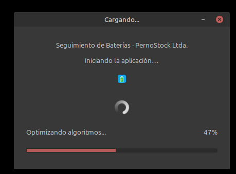
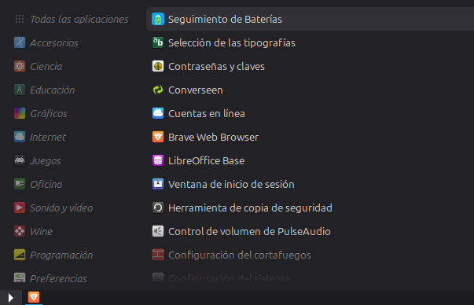

# Seguimiento de Baterías — PernoStock Ltda.

<p align="center"></p>


<p align="center"></p>

**Autor:** [Patricio Varela C.](https://github.com/2674321) · **ORCID:** [0009-0002-1087-9445](https://orcid.org/0009-0002-1087-9445) · **Licencia:** [MIT](LICENSE) · **Citación:** [CITATION.cff](CITATION.cff)

Sistema de escritorio para la gestión y seguimiento de baterías, desarrollado en
**Ruby 3.2.x + GTK3 + SQLite** (proyecto de formación, enero–febrero 2024).

> **⚠️ Software histórico recuperado de material de trabajo de PernoStock Ltda.**
> Se preserva como referencia histórica; no representa el estado actual de desarrollo
> ni software en uso por la empresa.

## Funcionalidades

- Registro, búsqueda y edición de baterías con validación de entradas.
- Historial de operaciones con búsqueda por fecha y orden invertible.
- Estadísticas de uso.
- Copias de seguridad: manuales, automáticas y temporizadas.
- Exportación de la base de datos a Excel.
- Manual de usuario integrado (`user_manual.rb`).

## Capturas

### Ventana principal



### Registro de batería



### Configuración



### Selector de columnas



### Pantalla de carga



### Icono en el menú del SO



## Stack

| Componente | Tecnología |
|---|---|
| Lenguaje | Ruby 3.2.x (original 3.2.2, Windows) |
| GUI | GTK3 |
| Base de datos | SQLite |
| Configuración | YAML |

## Requisitos (Linux/X11)

- GTK3 + dev headers (`libgtk-3-dev`, `libsqlite3-dev`, etc.) — ver `docs/DEV-SETUP.md`.
- [mise](https://mise.jdx.dev) (gestiona la versión de Ruby).

## Ejecución

```bash
cd seguimiento-baterias-pernostock-ltda
mise install
bundle install
bundle exec ruby main.rbw
```

## Prueba de interfaz (DB demo vacía)

```bash
DISPLAY=:0 mise exec -- bundle exec ruby _scripts/dev/prueba_interfaz.rb
```

Abre la ventana principal en el entorno gráfico con una base de datos vacía (los
datos reales de PernoStock NO se usan para pruebas — ver `docs/DEV-SETUP.md`).

## Estado del código

Auditado, depurado y estabilizado (rama plana `main` de este repo). El monorepo
histórico original queda preservado en la rama `historico-monorepo-2024`. Ver
`docs/AUDITORIA.md`.

## Autor

**Patricio Varela C.** (CA2OPX) · [ORCID 0009-0002-1087-9445](https://orcid.org/0009-0002-1087-9445) · [github.com/2674321](https://github.com/2674321)

## Licencia

MIT — ver [LICENSE](LICENSE).

## Citación

Metadatos de autoría y ORCID disponibles en [CITATION.cff](CITATION.cff).